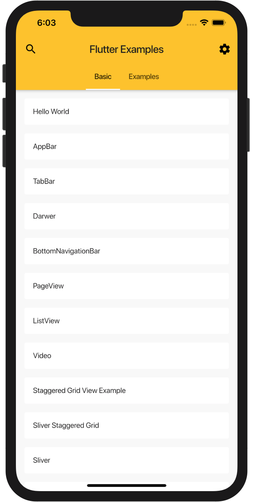

# flutter_examples

Flutter 小例子

## 运行

前提是你的 Flutter 环境已经搭建好了，Flutter 环境搭建请参考 [https://flutter.io/get-started/install/](https://flutter.io/get-started/install/)

```bash
git clone git@github.com:wangchi/flutter_examples.git
cd flutter_examples
flutter run
```

## 部分截图




## License

[MIT LICENSE](./LICENSE)
